# Introduction to Inverse Problems and Imaging

This repository contains materials for the master's course "Introduction to Inverse Problems and Imaging" at ČVUT. It
includes homework assignments, lecture notes, and MATLAB code focused on solving inverse problems using numerical
methods and regularization techniques.

## Homework Assignments

### Homework 1: Abel Integral Equation
This homework explores the inversion of the Abel integral equation, a classic ill-posed problem in inverse problems,
using regularization techniques like Truncated SVD and Tikhonov regularization to handle noise and instability.
- **Exam Slides**: [Exam_slides_1_Martin_Kunz.pdf](https://github.com/kunzaatko/InverseProblemsAndImaging/releases/download/v1.0.0/Exam_slides_1_Martin_Kunz.pdf)
- **Report**: [HW_1_Martin_Kunz.pdf](https://github.com/kunzaatko/InverseProblemsAndImaging/releases/download/v1.0.0/HW_1_Martin_Kunz.pdf)

#### Figures
- Singular system comparison for the heat equation: **(1)** Singular vectors for the discretized operator and the
  analytical singular functions, **(2)** singular values comparison, **(3)** heatmap of singular vectors

  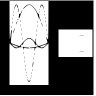
&nbsp; &nbsp; &nbsp; &nbsp;
  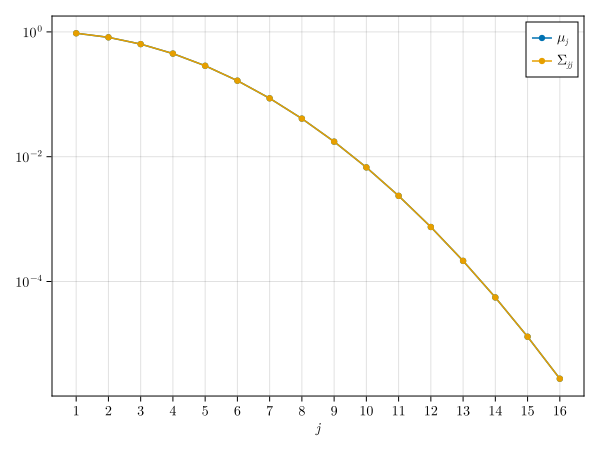

  

- Demonstration of the discretized heat operator: **(1)** Singular functions and their images under K and A, **(2)** sum
  of a random linear combination of singular functions

  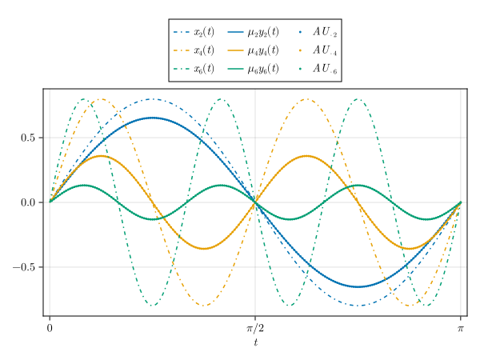
&nbsp; &nbsp; &nbsp; &nbsp;
  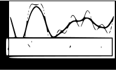

- Ill-posedness demonstration: **(1)** Fixed function, its image under K, and added noise, **(2)** Picard plot of
  singular values and coefficients

  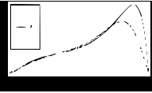
&nbsp; &nbsp; &nbsp; &nbsp;
  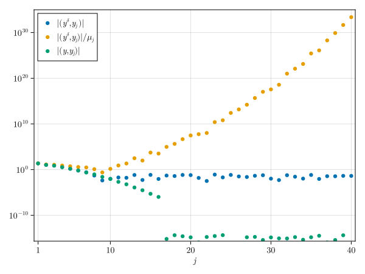

- Abel problem regularization: **(1)** Ground truth function, forward transformed data, and noisy data, **(2)** optimal
  TSVD and Tikhonov reconstructions, **(3)** TSVD reconstructions for various k, **(4)** relative error dependence on k,
  **(5)** Tikhonov reconstructions for various α, **(6)** relative error dependence on α

  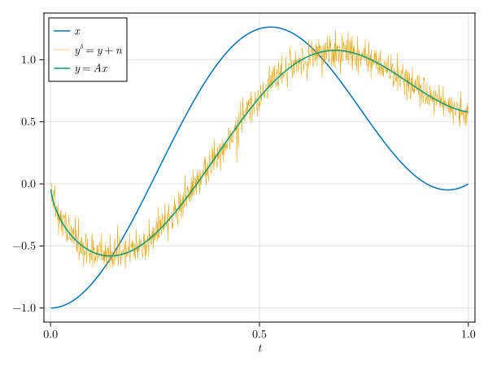
&nbsp; &nbsp;
  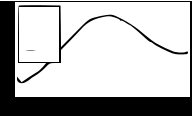
&nbsp; &nbsp;
  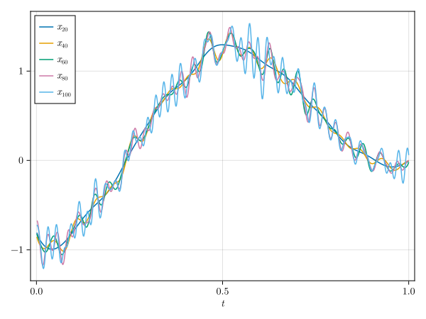

  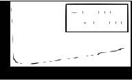
&nbsp; &nbsp;
  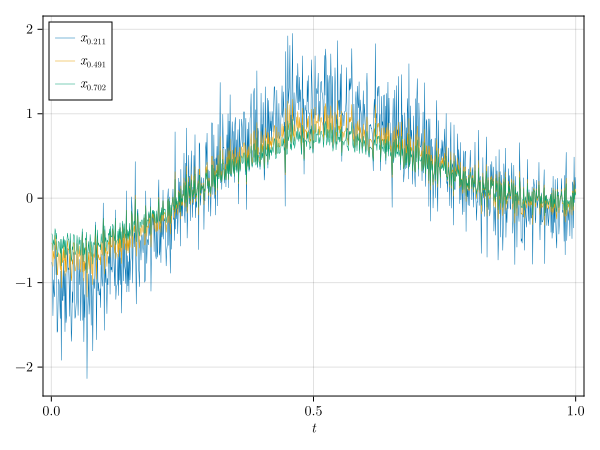
&nbsp; &nbsp;
  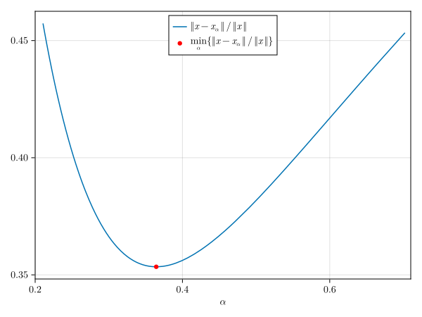

- Discontinuous Abel regularization: **(1)** Discontinuous function, its forward transform, and noisy data, **(2)**
  optimal TSVD and Tikhonov reconstructions, **(3)** TSVD reconstructions for various k, **(4)** relative error
  dependence on k, **(5)** Tikhonov reconstructions for various α, **(6)** relative error dependence on α

  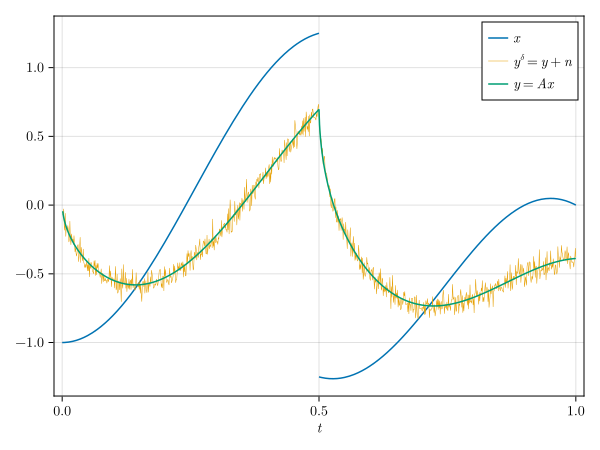
&nbsp; &nbsp;
  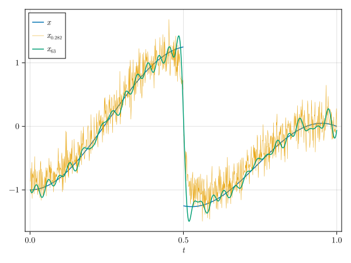
&nbsp; &nbsp;
  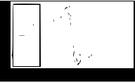

  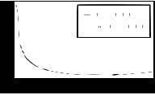
&nbsp; &nbsp;
  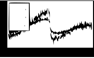
&nbsp; &nbsp;
  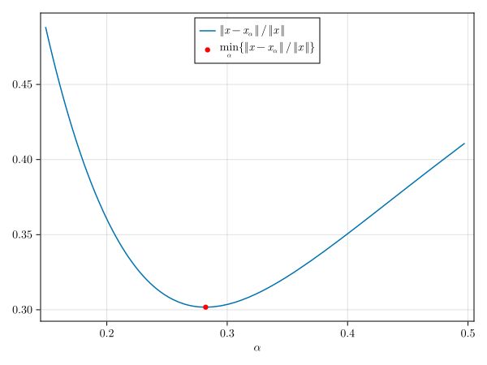

- Deblurring convergence demonstration: **(1)** Reconstructions with different regularization parameters, **(2)**
  relative error as function of noise level δ

  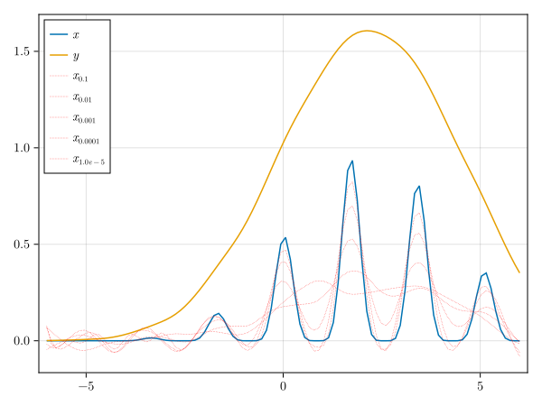
&nbsp; &nbsp; &nbsp; &nbsp;
  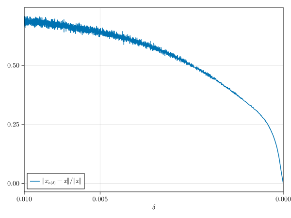

### Homework 2: Backwards Heat Equation
This assignment addresses the backwards heat equation, an extremely ill-posed inverse problem where small errors in data
measurements lead to large errors in the reconstructed initial condition, demonstrating the need for advanced
regularization methods.
- **Exam Slides**: [Exam_slides_2_Martin_Kunz.pdf](https://github.com/kunzaatko/InverseProblemsAndImaging/releases/download/v1.0.0/Exam_slides_2_Martin_Kunz.pdf)
- **Report**: [HW_2_Martin_Kunz.pdf](https://github.com/kunzaatko/InverseProblemsAndImaging/releases/download/v1.0.0/HW_2_Martin_Kunz.pdf)

#### Figures
- Heat equation forward solution: **(1)** The function $x(s_1, s_2) = \sin(ks_1) \sin(ls_2)$, **(2)** forward pass of
  the heat equation on implemented using FFT

  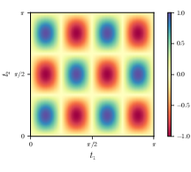
&nbsp; &nbsp; &nbsp; &nbsp;
  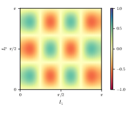

- Karin-Harbo painting heat equation inversion: **(1)** Ground truth image, **(2)** forward passed image with added 10%
  magnitude noise, **(3)** reconstructed image using Landweber iterations

  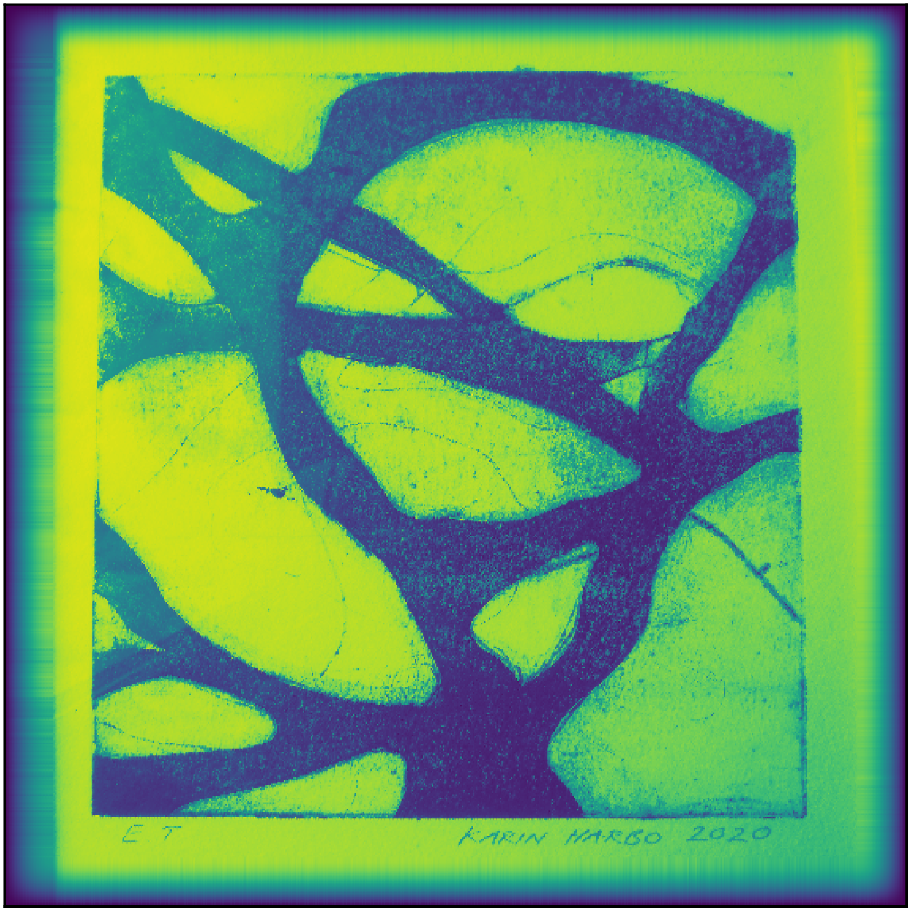
&nbsp; &nbsp;
  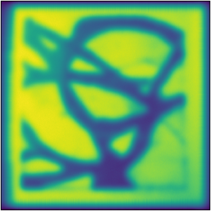
&nbsp; &nbsp;
  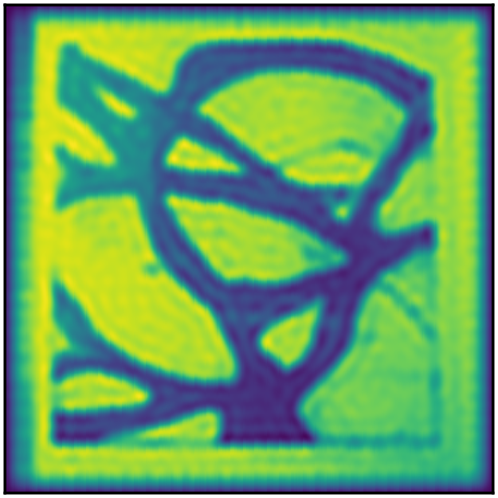

- Abel problem inversion: **(1)** Forward passed data $Ay$, analytical forward problem solution $y$ and the noisy data
  $y^\delta$

  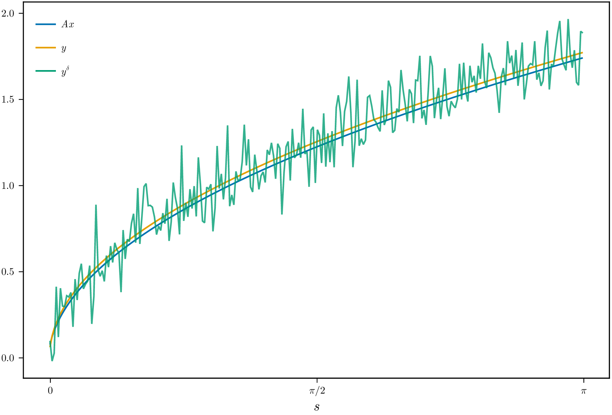

**(2)** Finding the ideal regularization coefficient for the Tikhonov regularization using the discrepancy principle,
**(3)** and the ideal regularization coefficient for the Sobolev regularization

  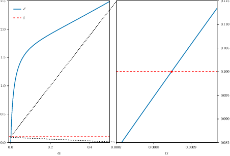
&nbsp; &nbsp; &nbsp; &nbsp;
  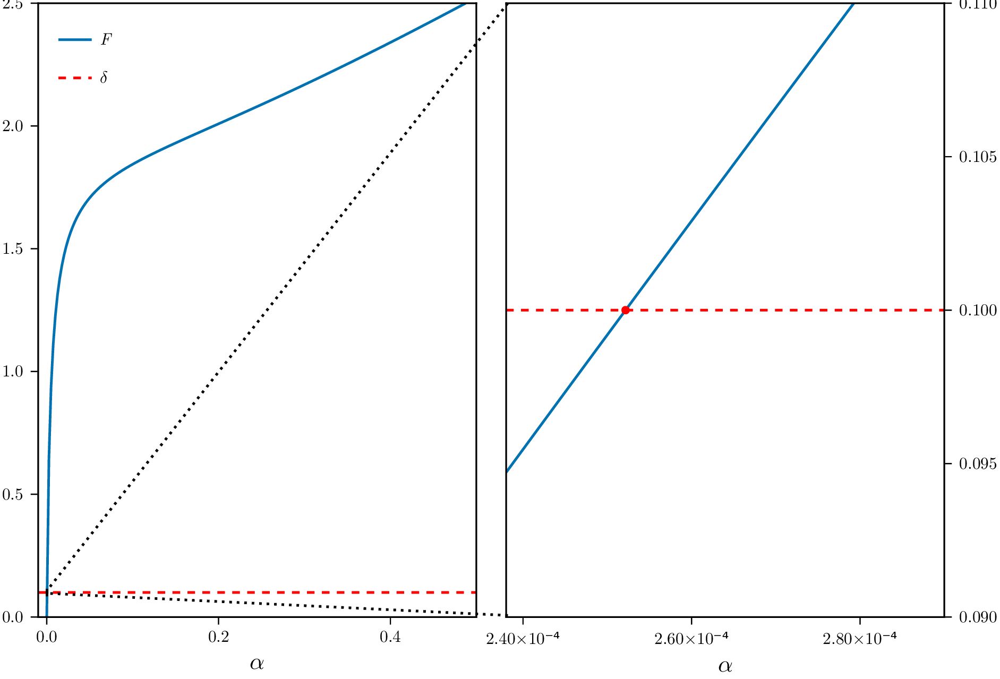

**(4)** Tikhonov and Sobolev regularized reconstructions and the initial function, **(5)** reconstruction using only the
$L_1$ matrix

  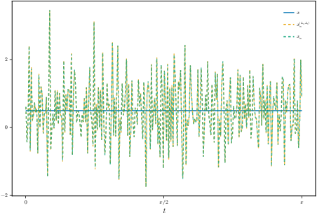
&nbsp; &nbsp; &nbsp; &nbsp;
  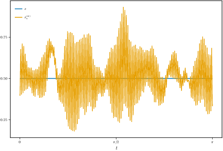

### Homework 3: Autoconvolution Inverse Problem
This homework deals with the non-linear inverse problem of autoconvolution, where the forward operator is a convolution
of the unknown function with itself, solved using Newton's method with appropriate regularization for convergence.
- **Report**: [HW_3_Martin_Kunz.pdf](https://github.com/kunzaatko/InverseProblemsAndImaging/releases/download/v1.0.0/HW_3_Martin_Kunz.pdf)

#### Figures
- Forward autoconvolution operator comparison: **(1)** Numerical quadrature solution vs. analytical solution, **(2)** their difference

  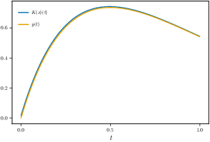
&nbsp; &nbsp; &nbsp; &nbsp;
  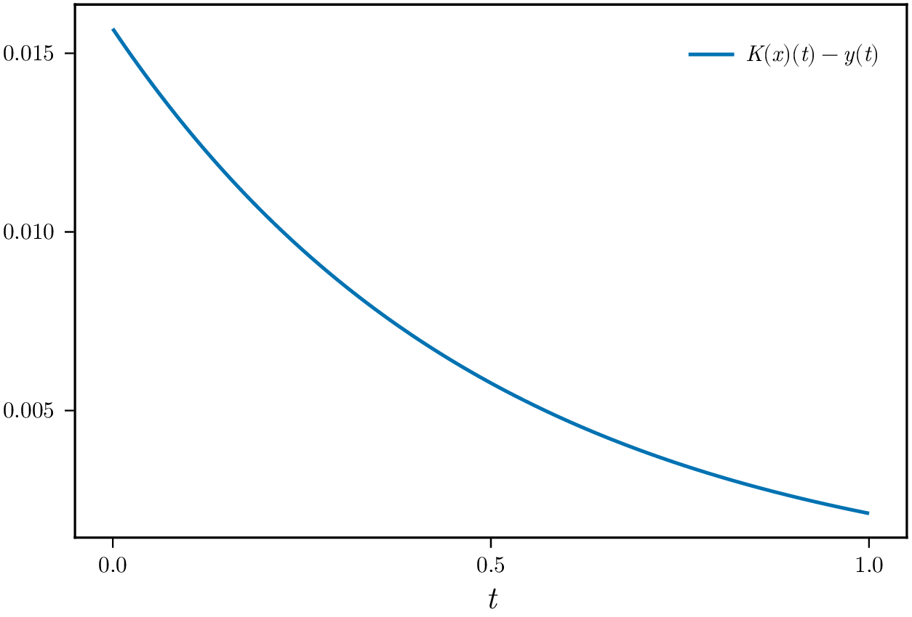

- Newton iteration reconstruction: **(1)** First Newton step with Tikhonov regularization, **(2)** convergence of first
  4 iterations with increasing regularization

  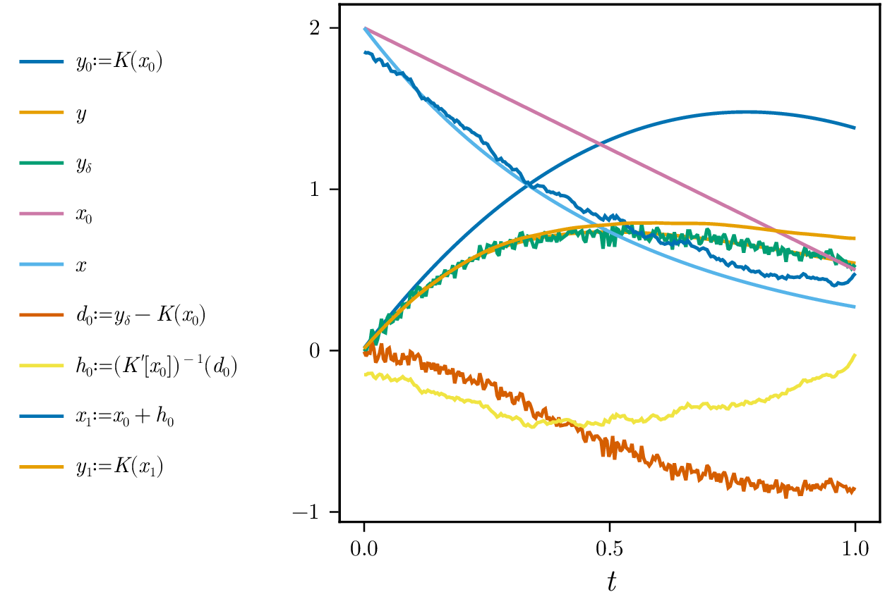
&nbsp; &nbsp; &nbsp; &nbsp;
  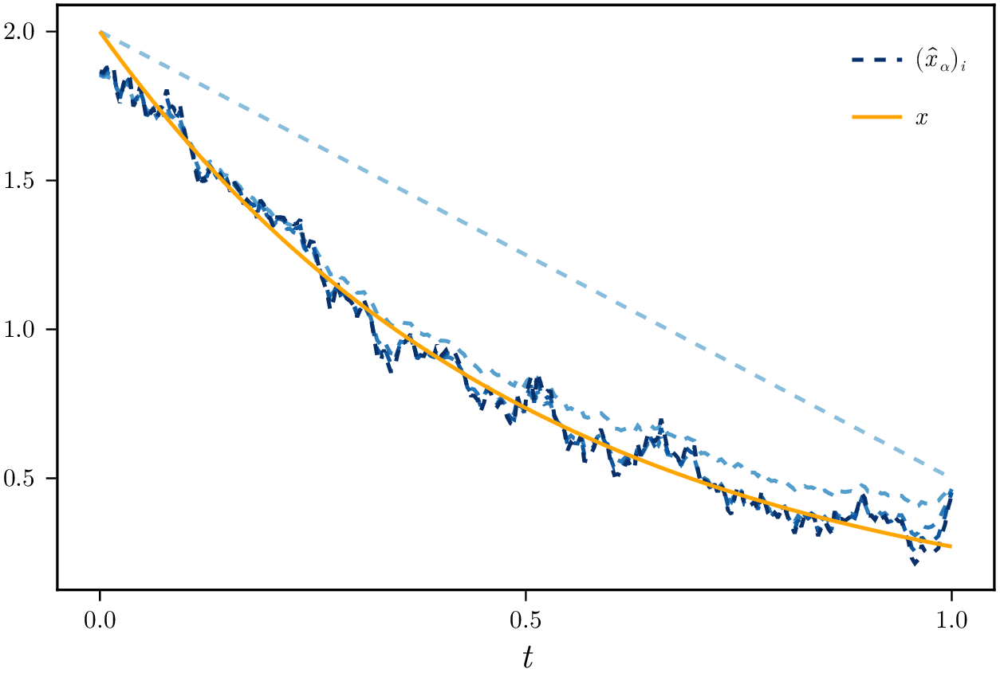

- Newton iterations from distant initial function: **(1)** 15 iterations failing to converge to the true solution,
  **(2)** 4 iterations converging to the negative solution

  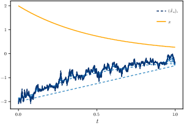
&nbsp; &nbsp; &nbsp; &nbsp;
  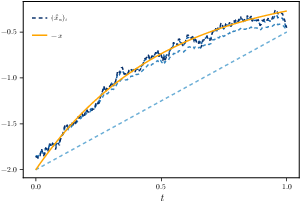

